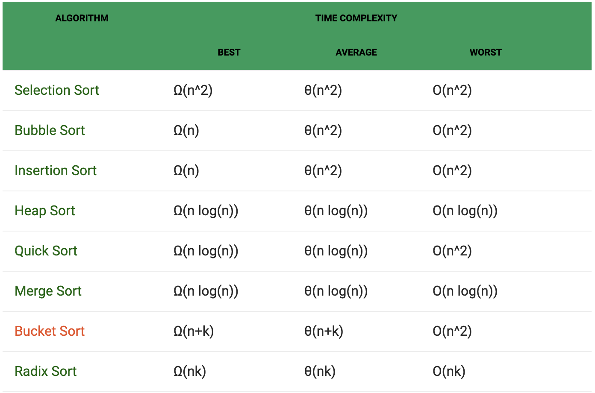

# Sorts

## What are sorts?

Sorting algorithms are algorithms that put elements of a list in a certain order. Sorts are often a part of more complex algorithms, such as merge and search algorithms. Sorts are also used to index records for more efficient usage later, as in a database. Formally, sorts are algorithms that put data into a specified ascending or descending order without modifying the original data.

## Why do we want to get good at sorts?

- To optimize our programs
- To better understand data manipulation
- To answer questions about sorts in job interviews
- They're interesting

## How do we evaluate sorts?

### Time Complexity and Adaptability

Time complexity is a measure of the time required for an algorithm to run relative to the size of the data being sorted.  We use Big O notation to describe the time complexity of an algorithm.  We measure time complexity in terms of best-case, average, and worst-case run time. These cases depend on how "pre-sorted" our original data is before being sorted.

Adaptability is the capacity of any sort to be able to run efficiently despite how the original data is laid out.

### Space Complexity

Space Complexity is a measure of how much computer memory is required to run an algorithm.  This is also described with Big O notation.

### Stability

A sorting algorithms stability comes into play when data has multiple properties, and can be sorted according to different criteria. Stable sort algorithms sort repeated elements in the same order that they appear in the input. This is to say that if two data points have a common property or the same value, they will remain in the same order in the output as they are in the input.  

In the examples below, the cards being sorted have two properties: rank and suit.  They are being sorted by rank.

In the stable sort, the cards with the same rank (the two 5s) maintain their order.  In the unstable sort, they switch order.

Some sorting algorithms are naturally stable, and most that are not can be modified to provide stability.

### Evaluation of common sorts

## Sort Visualization
[Visualgo](https://www.visualgo.net)

[The Sound of Sorting](https://www.youtube.com/watch?v=kPRA0W1kECg)

## Inefficient Sorts

While these sorts are inefficient, they can be practical, as they are easy to write, and require less overhead than better-performing sorts.  However, they only make sense to use with small data sizes.

### Bubble Sort

The worst sort in the world (with the exception of [Bogosort](http://www.algostructure.com/sorting/bogosort.php). Bubble sort moves through an array of data one at a time, compares each point to the next point, and switches them if they are not in ascending order.  This process repeats over and over until the whole array is sorted.

#### Steps

1. Iterate through the array from the beginning of the array.
2. As you go, check each element against the next element.  If the next element is less than the current, switch their positions. Continue until you reach the end of the array.
3. Repeat the process again from the beginning until the second from the end of the array, then the thirs from last, etc.

### Selection Sort

Selection sort involves iterating through an array from the 0th index, finding the smallest data point in the array, and moving that smallest value into that 0th index.  The process then repeats again with the 1st index, then the second, etc.

Selection sort is an *in-place* sort, meaning that it does not require any additional arrays or memory usage to run.

#### Steps

1. Define the first element in the array as the current element.
2. Iterate through the array and find the smallest element.
3. If this smallest element is less than the current element, swap their positions.
4. Repeat the process with the second, then the third, etc. as the current element until you reach the end of the array.

### Insertion Sort

The most efficient of these inefficient sorts (generally). In insertion sort, each element in the array is considered one at a time, and is swapped backwards towards the beginning of the array until it's in its appropriate place.  We iterate through the array, grab an element, then compare it with the element before it.  

If the element before it is greater than our selected element, we swap the two, and continue onward until we find a place where the preceding element is less than our selected, or we reach the front of the array.

#### Steps

1. Define the second element in the array as the current element.
2. Iterate backwards through the array, comparing the current element with each before it, swapping the current element with the comparison as you go.
3. When you find a comparison element that is smaller than the current or you reach the beginning of the array, end the iteration.
4. Repeat the process with the third, then the fourth, etc. until you reach the end of the array.

## Efficient Sorts

Efficient sorts can be complex, but are essential to sorting larger data sets.  Since these sorts are of (almost) linear time complexity or better, the size of our data sets does not matter.  There are complications that can decay our efficiency though. These sorts have high overhead, and perform poorly on already- or almost-sorted data. Many are also unstable, thought that can be fixed by adding more complex algorithms.

The sorts we are looking at today (and many other complex sorts) are of the divide-and-conquer method, where data is partitioned off into smaller and smaller containers in service of sorting.

### Bucket Sort

Bucket sort is an algorithm that distributes points in the data into "buckets", or other containers, based on their size.  Once in their buckets, the data can be quickly sorted by a simpler sorting algorithm (often insertion sort), then reassembled back into a larger sorted array.

Bucket sort uses both comparison and non-comparison sorting to accomplish its goal.  Comparison sorting involves comparing two values directly and ordering them, which we see when the values are sorted inside their buckets.  The scatter and gather portions of the sort are done non-comparatively, meaning that the sorting happens irrespective of the other values in the data set. Bucket sort excels at data sets that are well-distributed, as that means that there are few buckets with many elements in them that require conventional sorting. We also need to ensure that we pick an appropriate number of buckets. 

How many buckets should we use?  If we have too few, insertion sort is doing all of the work, and If we have too many, we use excessive computer memory.  The answer depends on your priority. If space is not a concern, you can use as many buckets as there are element in the array. If so, you can choose as few as the square root of the number of elements in the array.

#### Steps

1. Define a number of buckets to be used. The buckets are usually arrays all stored within a bucket container array.
2. Divide the elements in your input array into each of these buckets based on their sizes.
3. Sort each bucket using insertion sort.
4. Merge all of the buckets, from first to last, into one output array.

### Merge Sort

Merge sort relies on the fact that arrays of size 0 or 1 are automatically sorted, and subdivides our input array into arrays of these sizes.  We divide the array multiple times into multiple arrays of single element size, and then gradually merge these arrays. This provides us with larger and larger ***sorted*** arrays.  

Because these subarrays are already sorted, they become much easier to combine in the right order. Each time we merge, we get a new sorted array that we can compare with other sorted arrays, until we have reconstructed our original array, sorted.

#### Steps

1. Divide the input array into subarrays of half size.
2. Repeat this step for each subarray and resulting subarray until you have a collection of arrays of size 1 or 0.
3. Combine these into arrays of larger size, pushing in the smaller elements first.
4. Repeat this step until you have one output array.

### Quick Sort

Quick sort is perhaps the most popular common sorting algorithm, due to its quick speed and low memory usage.  Like merge sort, it divides the data set into arrays of size 0 or 1 and then reassembles them.  In quick sort, we choose one element in the array, called a pivot, and then sort the other elements in the array to the left or right of the pivot based on whether they're larger or smaller.  We repeat the process on the subarrays to the left and right of the original pivot until we are subdividing into arrays of size 0 or 1.

Quick sort, like many of the efficient sorts, has a fast average time, but a very poor worst-case. The difference between best and worst case for quick sort is pivot selection.  Ideally, we want each pivot to be the median of the data, so that the rest of the elements are sorted into equally sized subarrays to the left and right.  Choosing a pivot well can be done if we know whether the data comes in any particular order, or is somewhat sorted.  Generally, the pivot is selected from the front of the array (or subarray), the back, or randomly.

#### Steps

1. Select an element, called the pivot, from the array based on some criteria (randomly works well).
2. Divide all of the other elements in the array into two subarrays, based on whether they are smaller or larger than the pivot.
3. Repeat steps 1 and 2 until you have arrays or size 1 or 0.
4. Combine these arrays from "left" to "right" into one output array.